# SSI Personal Data Wallet - Architecture

## System Overview


## Component Architecture

### Frontend Components


### Backend Modules

```mermaid
graph TB
    subgraph "API Routes"
        AuthRoutes[/api/auth]
        DIDRoutes[/api/did]
        CredRoutes[/api/credentials]
    end
    
    subgraph "Controllers"
        AuthCtrl[Auth Controller]
        DIDCtrl[DID Controller]
        CredCtrl[Credentials Controller]
    end
    
    subgraph "Services"
        AuthSvc[Auth Service]
        DIDSvc[DID Service]
        CredSvc[Credentials Service]
    end
    
    subgraph "Common"
        DB[Database Config]
        Security[Security Utils]
        Logger[Logger]
    end
    
    AuthRoutes --> AuthCtrl
    DIDRoutes --> DIDCtrl
    CredRoutes --> CredCtrl
    
    AuthCtrl --> AuthSvc
    DIDCtrl --> DIDSvc
    CredCtrl --> CredSvc
    
    AuthSvc --> DB
    DIDSvc --> DB
    CredSvc --> DB
    
    AuthSvc --> Security
    DIDSvc --> Security
    CredSvc --> Security
    
    AuthSvc --> Logger
    DIDSvc --> Logger
    CredSvc --> Logger
```

## Authentication Flow


## DID Creation Flow


## Credential Issuance Flow


## Data Model

### Database Schema (MySQL)


### Credential Structure


## Security Architecture

### Encryption Layers

```mermaid
graph TB
    subgraph "Client Side"
        PK[Private Key<br/>🔐 IndexedDB]
        JWT[JWT Token<br/>🔐 localStorage]
    end
    
    subgraph "In Transit"
        HTTPS[HTTPS/TLS<br/>🔒 Encrypted Channel]
    end
    
    subgraph "Server Side"
        Helmet[Helmet.js<br/>Security Headers]
        RateLimit[Rate Limiting<br/>100 req/15min]
        Validation[Input Validation<br/>express-validator]
    end
    
    subgraph "Database"
        EncData[Encrypted Data<br/>AES-256-GCM]
        Params[Parameterized Queries<br/>SQL Injection Protection]
    end
    
    PK -->|HTTPS| HTTPS
    JWT -->|Bearer Token| HTTPS
    
    HTTPS --> Helmet
    Helmet --> RateLimit
    RateLimit --> Validation
    
    Validation --> EncData
    Validation --> Params
```



### Authentication Security

1. **No Passwords**: Challenge-response using Ed25519 signatures
2. **Time-Limited Challenges**: Expire after usage or timeout
3. **JWT Tokens**: 24-hour expiry, signed with server secret
4. **Signature Verification**: Cryptographic proof of key ownership

### Data Security

1. **Client-Side**:
   - Private keys never leave the browser
   - Stored in IndexedDB (browser-encrypted)
   
2. **Transport**:
   - HTTPS/TLS encryption
   - CORS protection
   
3. **Server-Side**:
   - Credentials encrypted with AES-256-GCM
   - Encryption key from environment variable
   - Parameterized SQL queries

## Deployment Architecture

### Docker Compose Setup


### Production Deployment


## Technology Stack

### Frontend Stack

| Layer | Technology | Purpose |
|-------|------------|---------|
| Framework | React 18 | UI framework |
| Routing | React Router v6 | Client-side routing |
| HTTP Client | Axios | API communication |
| Cryptography | TweetNaCl | Ed25519 signatures |
| Storage | localforage | IndexedDB wrapper |
| Styling | Vanilla CSS | Custom styling |

### Backend Stack

| Layer | Technology | Purpose |
|-------|------------|---------|
| Runtime | Node.js 18+ | JavaScript runtime |
| Framework | Express.js | Web framework |
| Database | MySQL 8.0 | Relational database |
| Cryptography | TweetNaCl, @noble/ed25519 | Signatures, encryption |
| Auth | JWT | Token-based auth |
| Security | Helmet, CORS | HTTP security |
| Logging | Pino | Structured logging |
| Metrics | prom-client | Prometheus metrics |
| Validation | express-validator | Input validation |

### Infrastructure

| Component | Technology | Purpose |
|-----------|------------|---------|
| Containerization | Docker | Application packaging |
| Orchestration | Docker Compose | Multi-container management |
| Database | MySQL 8.0 | Data persistence |
| Reverse Proxy | NGINX (optional) | Load balancing, SSL |

## API Design Principles

1. **RESTful**: Standard HTTP methods (GET, POST, PATCH, DELETE)
2. **Stateless**: JWT tokens, no server-side sessions
3. **Versioned**: `/api/v1/...` (future-proofing)
4. **Consistent**: Uniform error responses
5. **Secure**: Authentication on all routes except /auth

## Scalability Considerations

### Horizontal Scaling

- **Stateless Design**: No server-side sessions
- **Database Connection Pooling**: Efficient DB connections
- **JWT Tokens**: No need for shared session store

### Performance Optimizations

- **Indexing**: Database indexes on frequently queried fields
- **Rate Limiting**: Prevent abuse
- **Compression**: Response compression (future)
- **CDN**: Static assets (frontend production build)

### Future Enhancements


---

## Key Design Decisions

### 1. Client-Side Key Generation
**Why**: Maximum security - private keys never transmitted

### 2. DID Method: `did:key`
**Why**: Simple, self-contained, no blockchain required

### 3. Ed25519 Cryptography
**Why**: Fast, secure, small signatures

### 4. JWT Authentication
**Why**: Stateless, scalable, industry standard

### 5. MySQL Database
**Why**: Reliable, high performance, industry standard

### 6. Docker Deployment
**Why**: Consistency, easy deployment, isolation

---

For implementation details, see [README.md](../README.md) and [API Documentation](API_DOCUMENTATION.md).
